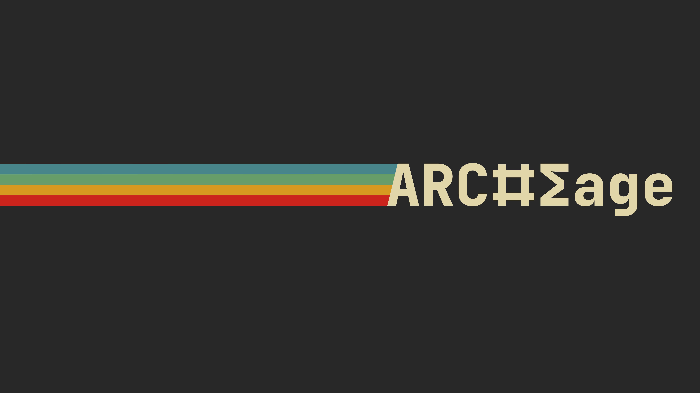

## C# : Swis Army Knife

- Paradigma : OOP, Struct, Functional
- Parallelisme : Async/Await, Task Parallel Library
- Build : JIT, R2R, AOT/Native Binary
- Type : Garbage Collection, Runtime
- Tools : .NET SDK, Nuget

## Zig : The Low Level

* Paradigma : Struct-Oriented, Compile-time, No hidden control flow
* Parallelisme : Async/await, Multithread
* Build : AOT/Native Binary
* Tools : Zig Compiler, Zigmod
* Type : Manual Allocate / Free, Compile Time

## Java : Enterprise Ready

* Paradigma : OOP, Functional (Streams, Lambdas)
* Parallelisme : Threads, Virtual Threads, Reactive Programming
* Build : JIT, AOT/Native Binary
* Tools : OpenJDK, GraalVM, Maven.
* Type : Garbage Collection, Runtime

## Rust : Safe Systems
* Paradigma : Struct-Oriented, Functional, Minimal OOP
* Parallelisme : Async/Await, Threads, Futures
* Build : AOT/Native Binary (LLVM)
* Tools : Rust Compiler (rustc), Cargo, Crates.io
* Type : Ownership + Borrowing, No Garbage Collector