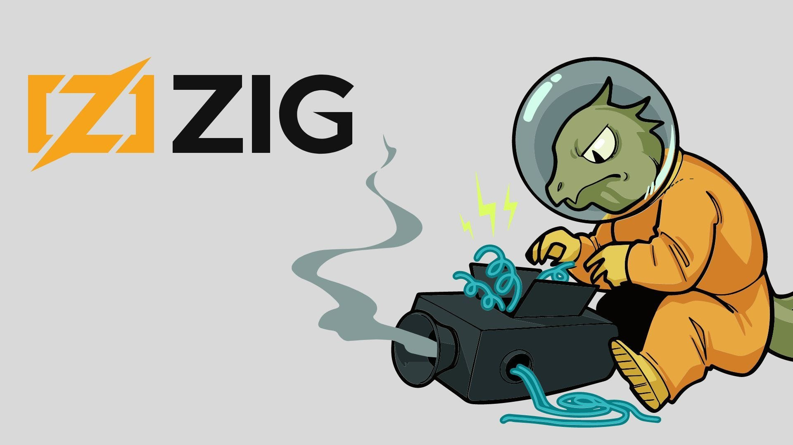

# Zig Programming Language

## Installation
## Aturan dan Penamaan Sintaks
# 0. Introduction

> Comparative references across C#, Zig, Java, and Rust.

## Installation, Running Hello World

## Toolchain & Workload

## Karakteristik, Aturan & Penamaan

# 1. Basic
## 1.1 Data Types
### 1.1.1 Numbers (integers, floats, comptime numbers)
### 1.1.2 Characters (u8, UTF-8 awareness)
### 1.1.3 Boolean
### 1.1.4 Pointer (raw pointers, many pointer types)
### 1.1.5 Empty Data Type (`void`)
### 1.1.6 Aliasses (`const X = ...`)
### 1.1.7 Type Checking (`@TypeOf`)

## 1.2 Konversi, Type Check, & Casting Tipe Data
## 1.3 Data items (const, var, comptime)
## 1.4 Data Structures
### 1.4.1 Array
### 1.4.2 List (ArrayList from std)
### 1.4.3 Dictionary (HashMap)
### 1.4.4 Struct
### 1.4.5 Interface (Tidak ada, pakai function pointers / generic)
### 1.4.6 Enum
### 1.4.7 Object (Tidak ada class, gunakan struct + function)
### 1.4.8 Tuple (Zig uses struct)
### 1.4.9 Anon Object (anonymous struct)
### 1.4.10 Blocking Queue (implementasi manual / std.Channel)
### 1.4.11 Channel (`std.Channel`)

## 1.5 Operators
## 1.6 Control Flow
### 1.6.1 Conditionals
### 1.6.2 Loopings

## 1.7 Null-Safety (`?T` optional)
## 1.8 Input-Output (std.io)
## 1.9 Using Keyword (Zig tidak punya, gunakan `usingnamespace`)

# 2. Programming Paradigms

# 3. Functional Programming
## 3.1 First-class Functions (function pointers)
## 3.2 Main Function
## 3.3 Pure Function-style
## 3.4 Recursion
## 3.5 Immutable Variable di Function (const)
## 3.6 Fungsi dengan return value dan tidak
## 3.7 Function Parameter
## 3.8 Main Function Parameter
## 3.9 Function Short Expression (inline functions)
## 3.10 Higher Order Functions (via generics)
## 3.11 Method-like Function (struct methods)

# 4. Struct
## Packed struct, extern struct, anonymous struct

# 5. Object-Oriented Programming
## (Zig tidak punya OOP)
## Emulation via:
### Struct + Functions
### Interfaces via function pointers
### Composition over inheritance

# 6. Exception & Error Handling
## Zig Error Union (`!T`)
## `try` keyword
## `catch`
## Panics

# 7. Concurrency & Parallel Programming
## Async/Await (Zig async)
## Manual thread usage
## Mutex, Atomics
## Race Condition

# 8. Generic
## Comptime generics
## Type inference with `var`
## Generic functions
## Generic types via comptime parameters

# 9. Domain-Specific Language
## Zig as DSL host: comptime, metaprogramming, type generation

# 10. Package Manager
## Zig build system (`build.zig`)
## Zig package manager (builtin)

# 11. Testing & Debugging
## Built-in testing (`test {}`)
## Debugging via `@panic`, logging, LLDB

# 12. Keywords & Syntactic Sugar
## `comptime`, `defer`, `errdefer`, `inline`, `orelse`, `catch`, `try`

# 13. Regular-Expression
## (Tidak built-in, pakai library external)

# 14. Preprocessor Directives
## Tidak ada — gunakan comptime

# 15. Memory Management
## Allocator model
## Manual allocation & free
## Arena allocator
## General-purpose allocator
## No GC

# 16. Performance Engineering
## Manual memory optimization
## Inline & comptime optimizations
## Build options
## Profiling tools

# 17. Monitoring & Diagnostic
## Logging (std.log)
## Debug assertions
## Panic handlers

# 18. Build System & Project Architecture
## build.zig (major topic)
## Step-based build graph
## Multi-module layout

# 19. Design Patterns
## Zig-style patterns (comptime patterns, error union patterns)

# 20. Module System & Visibility Rules
## `pub`, package import, namespace

# 21. Networking Fundamentals
## std.net
## TCP/UDP

# 22. File System & OS Interaction
## std.fs
## OS syscalls wrapper

# 23. Serialization & Interoperability
## JSON (std.json)
## Binary
## C Interop (`@cImport`)

# 24. Reflection & Meta-programming
## comptime reflection (`@typeInfo`)
## type generation
## compile-time code execution

# 25. Ecosystem & Frameworks
## stdlib
## community packages (zap, bun-inspired)