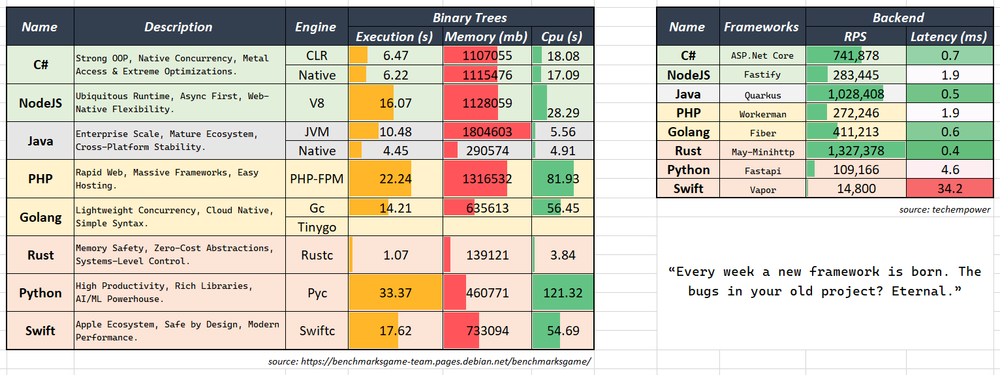

## ⛩️ C# | NodeJS | Programmer

Passionate about **Software Engineering**. With a focus on building scalable and performant systems. where concurrency meets caffeine, bytecode brew resilience.

| Aspect      | 🦈 C#                  | 🍵 NodeJS              | ☕ Java (forgework)       |
|-------------|------------------------|------------------------|---------------------------|
| **Engine**  | CoreCLR, Roslyn        | V8                     | OpenJDK, GraalVM          |
| **Libraries** | SignalR              | Piscina                | Resilience4J              |
| **Tuning**  | JIT/R2R, GC Config     | Clustering             | GC Tuning, AOT            |
| **Tools**   | Nuget, Dotnet CLI      | NPM, PM2               | Maven, JConsole           |
| **Archs**   | Multithread, Async/Await | Single-thread, Event Loop | Multithread, JVM      |
| **Workload**| CPU-Bound              | I/O-Bound, Realtime    | CPU-Bound, Mission-Critical |
| **Scaling** | Horizontal + Vertical  | Horizontal + Multi-instance | Horizontal + Vertical  |
| **Used For**| Startup, Enterprise    | Startup                | Enterprise, Banking       |
| **Used By** | Microsoft Teams        | Walmart                | Netflix                   |
| **Benchmarks** | 741,878 RPS / 0.7 ms | 283,445 RPS / 2.0 ms   | 1,028,408 RPS / 0.5 ms    |
| **Rating**  | ⭐⭐⭐⭐⭐                | ⭐⭐⭐⭐                 | ⭐⭐⭐⭐⭐                   |

<!-- 
## ☕ Java | Forgework

Proven for nearly 30 years as the backbone of robust & concurrent with a vast ecosystem and extreme optimizations.

### **⛔ Avoided**
- **PHP** : no native concurrency
- **Go** : over-minimalist & boilerplate-heavy
- **Rust** : painful syntax, high cognitive load
- **Python**: slow at raw performance, duck typing overhead
- **Swift** : weak ecosystem, niche adoption 

-->
