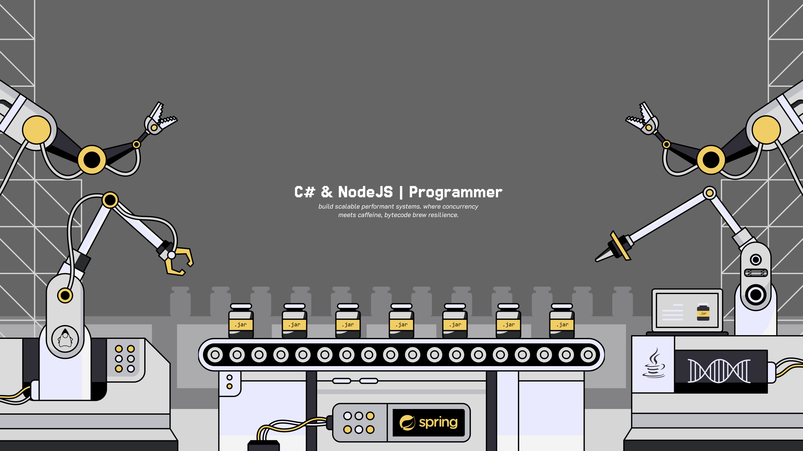

<!-- # ⛾ C# & NodeJS | Java -->

- **Corework** : C# & NodeJS | Java
- **Databases** : PostgreSQL, Redis
- **Orchestration**
  - CI/CD : Github Actions, Jenkins
  - Podman + Kubernetes (Optional)
- **Event Bus** :
  - RabbitMQ, Kafka, NATS
  - Redis Pub/Sub
- **Observability & Monitoring**
  - Grafana + Prometheus atau Elastic Stack (ELK)
  - Sentry / LogRocket
- **API Layer**
  - API Gateway (Kong / Traefik / Nginx)
- **Securiy Enhancements**
  - JWT / OAuth2 / OpenID Connect
  - Vault / AWS Secrets Manager
- **Caching & Search**
  - In-memory (Dragongly/Redis)
  - Elasticsearch

⛔ **Less Preferred**
- 🕊️ weak ecosystem / adoption
- 🐘 lacks native concurrency
- 🐭 over-minimalist, boilerplate
- 🐍 slow in raw, duck typing
- 🦀 horrible, just skill issues