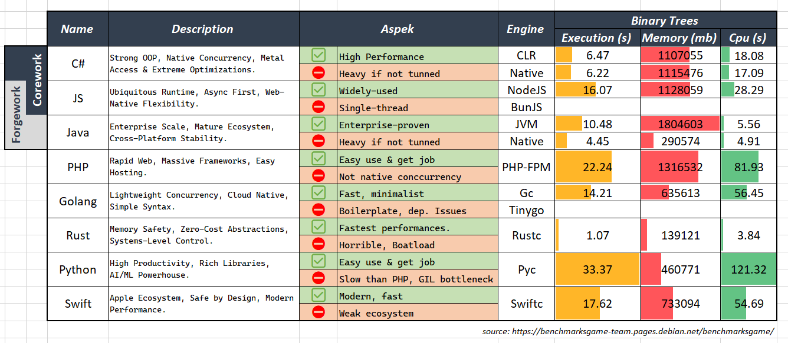

### ⛩️ C# | NodeJS | Programmer
build scalable and performant thats proven by design where robust & no horrible, concurrency & parallelism , metal-access & extreme optimizations and wide-ecosystem.build scalable and performant thats proven by design where robust & no horrible, native concurrency, metal-access & extreme optimizations and wide-ecosystem.

### ☕ Java | Forgework
- Framwks : Spring, Quarkus
- Runtimes : OpenJDK, GraalVM, MicroEJ
- Optimizes : GC Tunning, NativeAOT
- Tools : Maven, JShell, JFR, JConsole

**⛔ Avoided**
- PHP : no native concurrency
- Go : over-minimalist & boilerplate-heavy
- Rust : painful syntax, high cognitive load
- Python : slow at raw performance, duck typing overhead
- Swift : weak ecosystem, niche adoption

