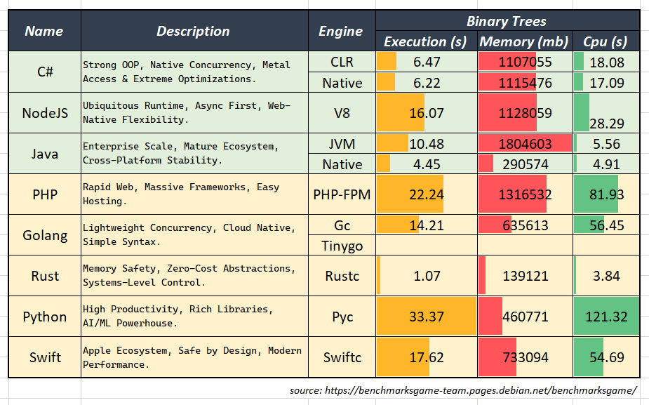

## ⛩️ C# | NodeJS | Programmer
Passionate about Software Engineering. With a focus on building scalable and performant systems, where concurrency meets caffeine.

## ☕ Java | Forgework
Proven for nearly 30 years as the backbone of robust & concurrent with a vast ecosystem and extreme optimizations.

### **⛔ Avoided**

- **PHP** : no native concurrency
- **Go** : over-minimalist & boilerplate-heavy
- **Rust** : painful syntax, high cognitive load
- **Python**: slow at raw performance, duck typing overhead
- **Swift** : weak ecosystem, niche adoption

